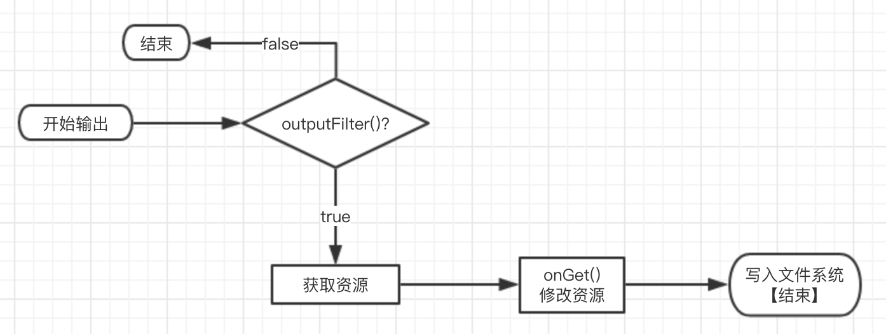
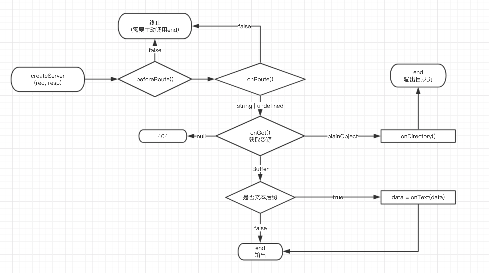
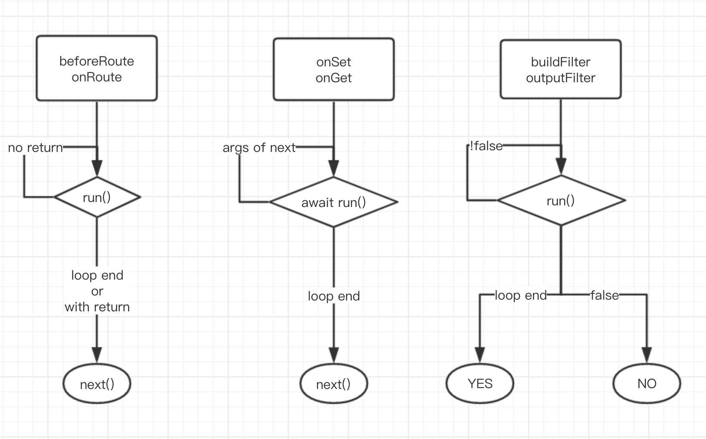
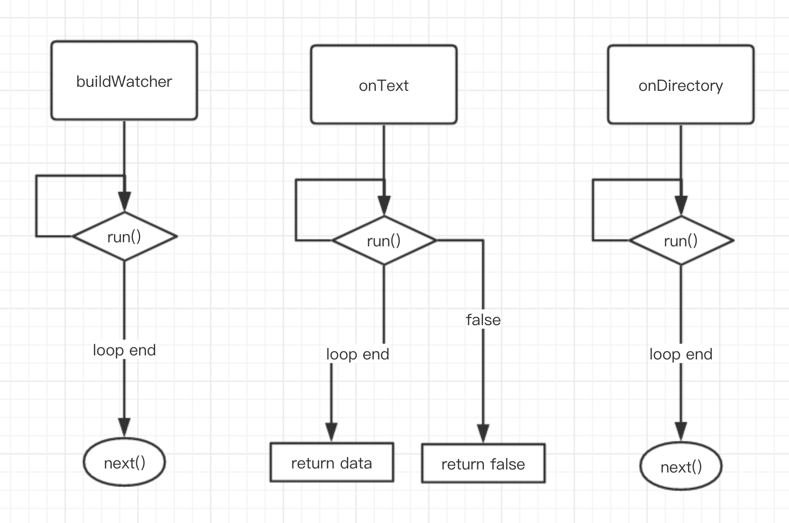
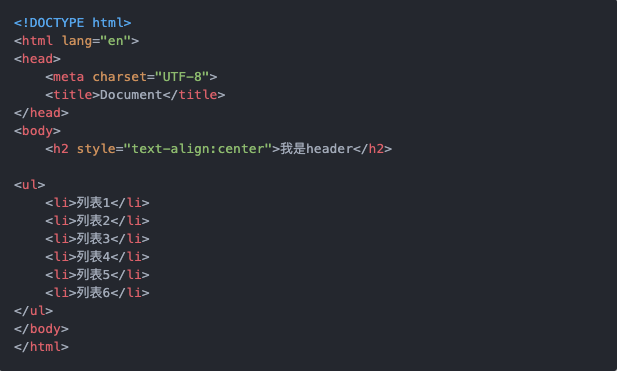

title: f2e-server
author: shiyangyang
keywords: f2e-server 基于Node.js的前端开发服务器
style: https://cdn.bootcss.com/bulma/0.7.5/css/bulma.min.css, https://cdn.bootcss.com/font-awesome/4.0.2/css/font-awesome.min.css
style: https://cdn.bootcss.com/animate.css/3.7.2/animate.min.css

[page class="is-dark" animated="fadeIn"]

# <i class="fa fa-fw fa-home"></i> f2e-server 

    基于Node.js的前端开发服务器

1. 开发背景
2. 竞品分析
3. 基本功能
4. 实现原理
5. 中间件
6. 在线PPT模板开发

[page class="is-primary is-bold" animated="fadeInLeft"]

# <i class="fa fa-fw fa-question-circle"></i> 开发背景

    前端开发基本需求 & 日渐复杂的开发场景

- 基本的静态文件服务器 `Server`
- 自动刷新  `livereload`
- 代码转换校验  `compile & lint`
  - CoffeeScript/ES-Next/TypeScript/JSX => JS
  - LESS/SASS => CSS
  - Jade(Pug)/Template => HTML
  - ...
- 代理接口调试 `Proxy`
- 文件压缩合并优化 `Uglify Minify Bundle`
- ...

[page class="" animated="zoomIn"]

# <i class="fa fa-fw fa-list"></i> 竞品分析

    前端开发环境变化历程的缩影

1. **YUI Compressor**  
   Java开发的老牌资源压缩工具，一度成为jQuery之类的一等JS库默认压缩工具
2. **NPM Scripts**  
   通过alias方式执行shell命令，依赖另外的shell满足基本构建需求
3. [**Grunt**](https://gruntjs.com)  
   任务管理模式，开始基于Nodejs完成服务端构建任务
4. [**Gulp**](http://gulpjs.com)  
   任务管理模式，支持了文件读写监听等模式、支持流式处理资源
5. [**FIS3**](https://fex.baidu.com/fis3/)  
   混合资源输入输出模式，基本上开箱即用、默认集成大量常用前端工具
6. [**Webpack**](https://webpack.js.org)  
   模块化打包工具，所有资源都通过JS模块化bundle
7. [**Rollup**](https://rollupjs.org)  
   ES模块打包工具 `Tree Shaking` and `Scope Hoisting`

> f2e-server 更接近 FIS3 的方式

[page class="is-primary is-bold" animated="fadeInLeft"]

# 基本功能

    f2e-server 核心功能表

- 基础服务器
- 资源压缩
- 自动刷新
- ES、LESS、EJS 编译支持
- include belong 支持 
- 代理
- 扩展支持

[page class="is-link is-bold" animated="rollIn"]

# 实现原理 - 输入

    资源加载到内存: 文件过滤和文件监听需要在资源加载流程中处理

[page class="is-link is-bold" animated="zoomInUp"]

# 实现原理 - 输出

    资源资源存储到文件系统

[page class="is-link is-bold" animated="flipInX"]

# 实现原理 - HTTP

    HTTP-Server 对接持久化接口 & 新增接口

[page class="is-link is-bold" animated="flipInY"]

# 实现原理 - Middleware

中间件模式: 中间件管理器实现各种接口的 链式(Promise链式)封装 `onGet/onSet/buildFilter/outputFilter` 同时支持build模式

[page class="is-light" animated="fadeInRight"]

# 内置中间件 - [include](https://github.com/shy2850/f2e-server/blob/master/lib/middleware/include.js)
1. 基本思路: `onSet` 接口修改文本替换
2. 注意事项: `buildWatcher` 如果是被引用的资源也需要重新构建 母文件

[page class="is-dark" animated="bounceInLeft"]

# 内置中间件 - [livereload](https://github.com/shy2850/f2e-server/blob/master/lib/middleware/livereload.js)
1. 只在HTTP-Server 开发环境下可用、不得设置 `onSet` & `onGet`
2. 使用 [ServerSentEvent](https://developer.mozilla.org/zh-CN/docs/Server-sent_events/Using_server-sent_events) 支持。 实时性强、单向推送、适合livereload场景。

[page class="is-light" animated="fadeIn"]

# 其他中间件 - [f2e-middleware](https://github.com/f2e-server/f2e-middleware)

    其他中间件

1. `babel` 【内置】[Babel](https://www.babeljs.cn/) 编译支持
2. `less` 【内置】[Less](https://less.bootcss.com/) 编译支持
3. `template` 【安装依赖】[Lodash](https://lodash.com/) template 实现
4. `markdown` [marked](https://marked.js.org) 封装
5. `proxy` 基于 [request](https://www.npmjs.com/package/request) 实现代理
6. `qrcode` 一个简单的字符串转二维码图片的接口实现
7. `typescript` [TypeScript](https://www.typescriptlang.org/) 单文件编译实现
8. `sass` [Sass](http://sass.bootcss.com/) 编译支持
9. `rollup` [Rollup](https://www.rollupjs.com/guide/zh) 支持
10. `webpack` [Webpack](https://www.webpackjs.com/)
11. `authority` 公司内部使用的轻量级 **权限验证、权限-角色-用户管理** 通用组件
12. `markdown-ppt` [MarkdownPPT](https://github.com/f2e-server/f2e-middle-markdown-ppt) 基于[marked](https://www.npmjs.com/package/marked)简单在线PPT演示

[page class="is-success is-bold" animated="flash"]

# MarkdownPPT

    MarkdownPPT 当前在线PPT实现原理

